# Rendu TP-GITHUB - Ange-Kevin AGRE (LA_Surprise)

## Niveau 1 : Workflow Git de base

### Étape 1 : Fork du repository

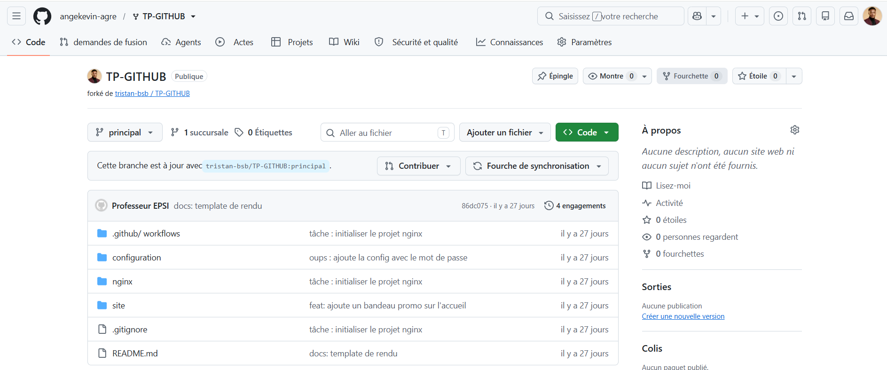

### Étape 2 : Configuration Git locale

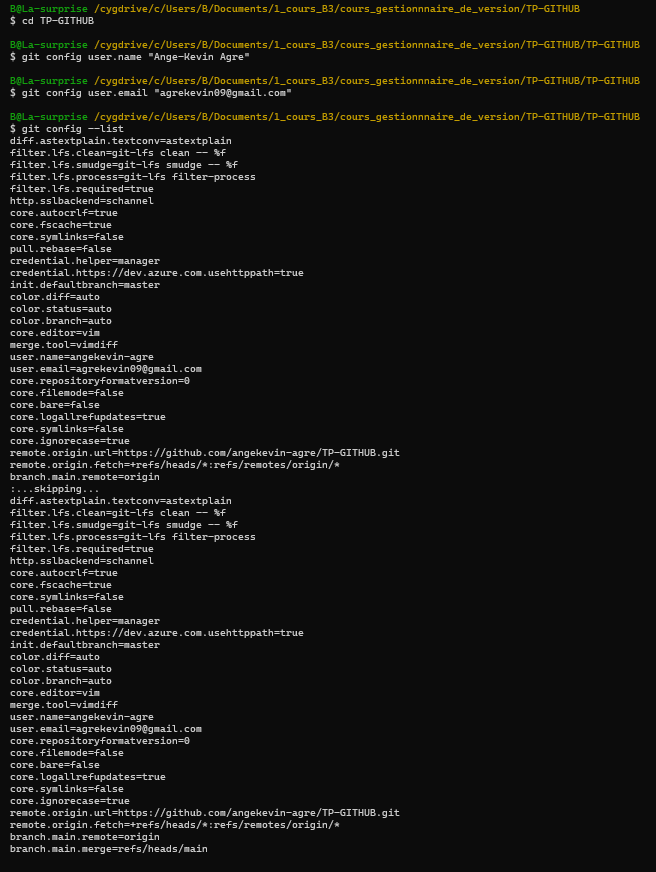

### Étape 3 : Configuration upstream

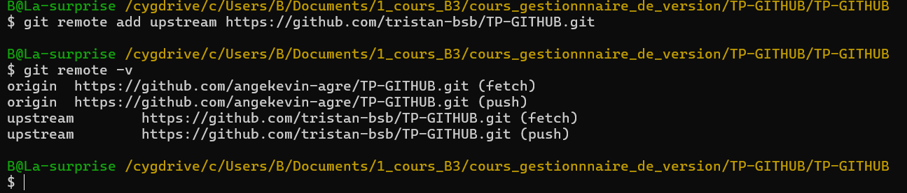

### Étape 4 : Création de la branche feature

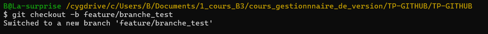

### Étape 5 : Premier commit

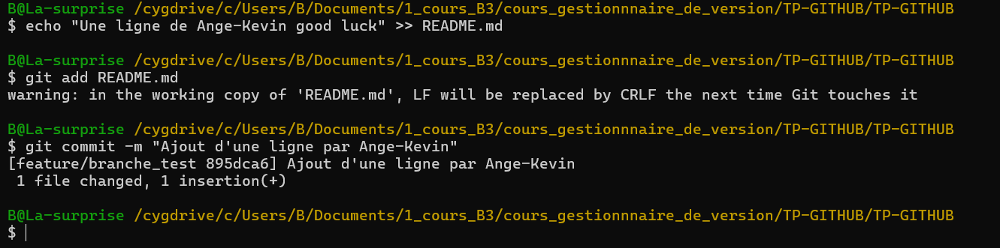

### Étape 6 : Push vers origin

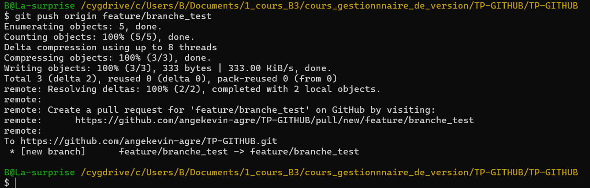

### Étape 7 : Création PR locale

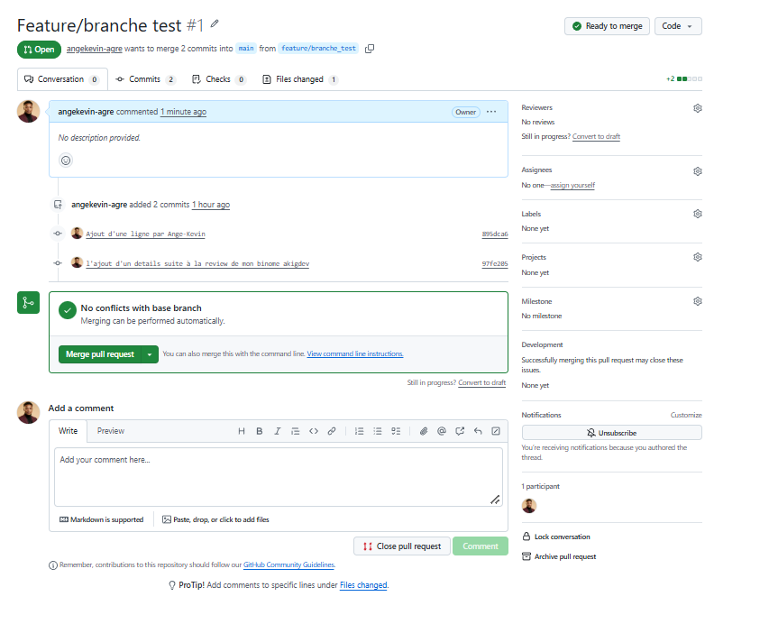

### Étape 8 : Commentaire du binôme

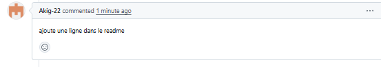

### Étape 9 : Réponse aux commentaires

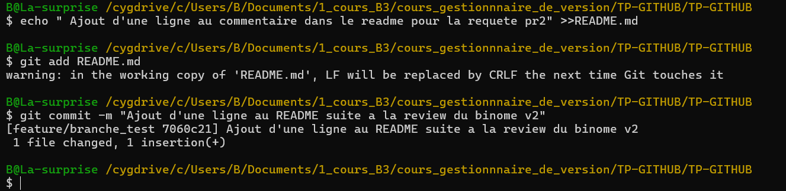

### Étape 10 : Push de la réponse

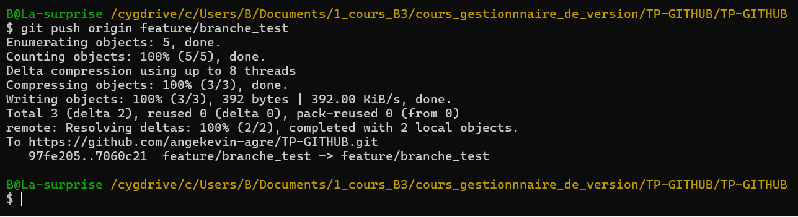

### Étape 11 : Merge de la PR

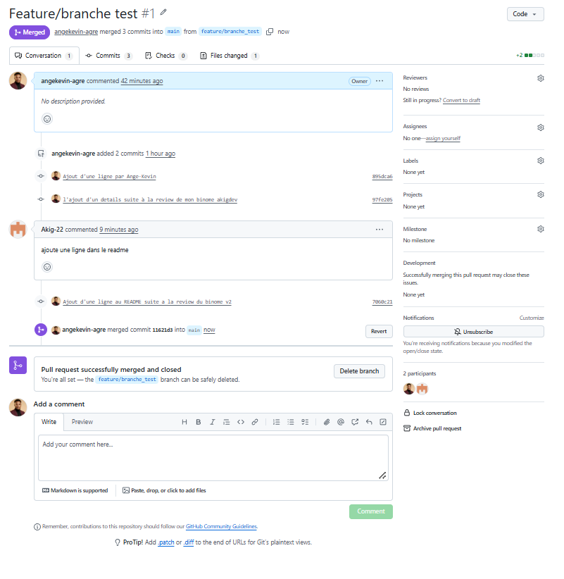

## Niveau 2 : Manipulations Git avancées

### Manip 1 : Suppression d'un secret du suivi Git

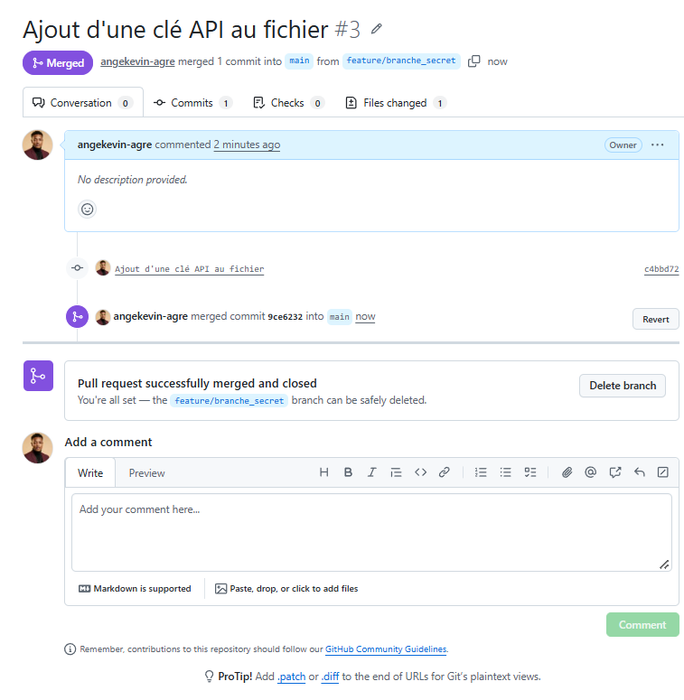

### Manip 2 : Création et visualisation d'un conflit

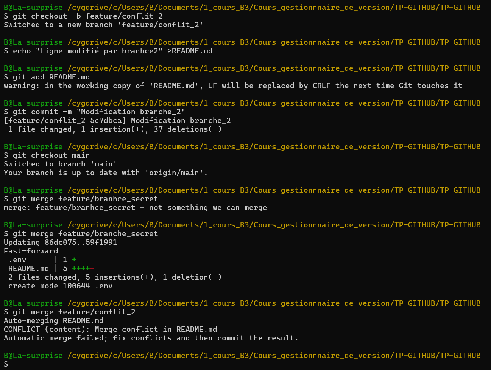

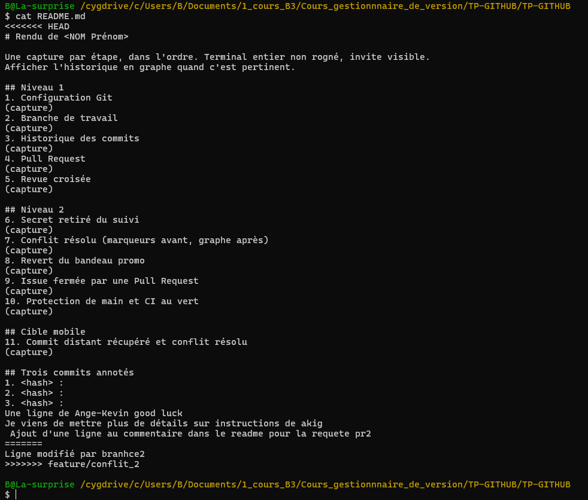

### Manip 3 : Résolution du conflit

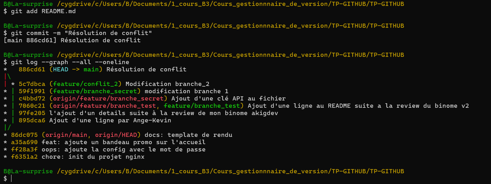

### Manip 4 : Revert d'un commit et d'une PR

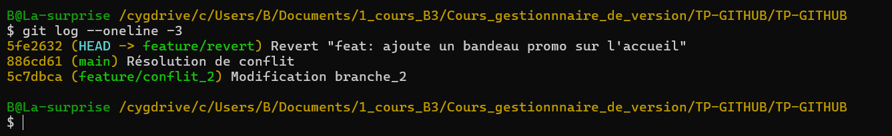

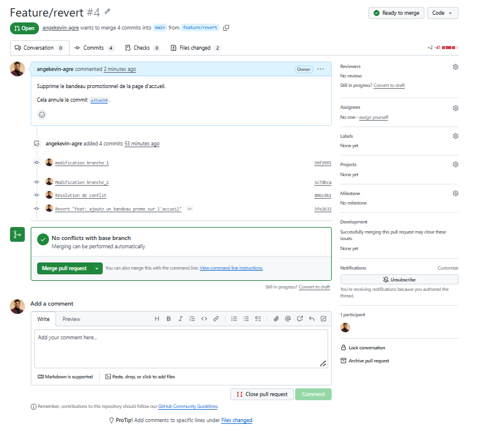

### Manip 5 : PR qui ferme une issue

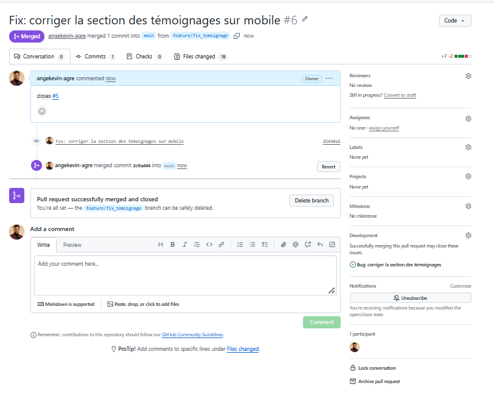

## Bonus: Amélioration du design

Amélioration du design et des styles du site.

Étapes:
- Créer la branche feature/ameliorer-design
- Amélioration des couleurs et espacements
- Fusion sur le repo personnel et PR vers le prof

Captures:

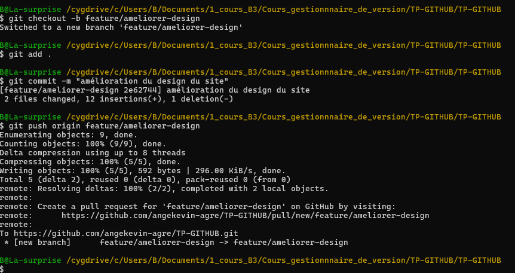

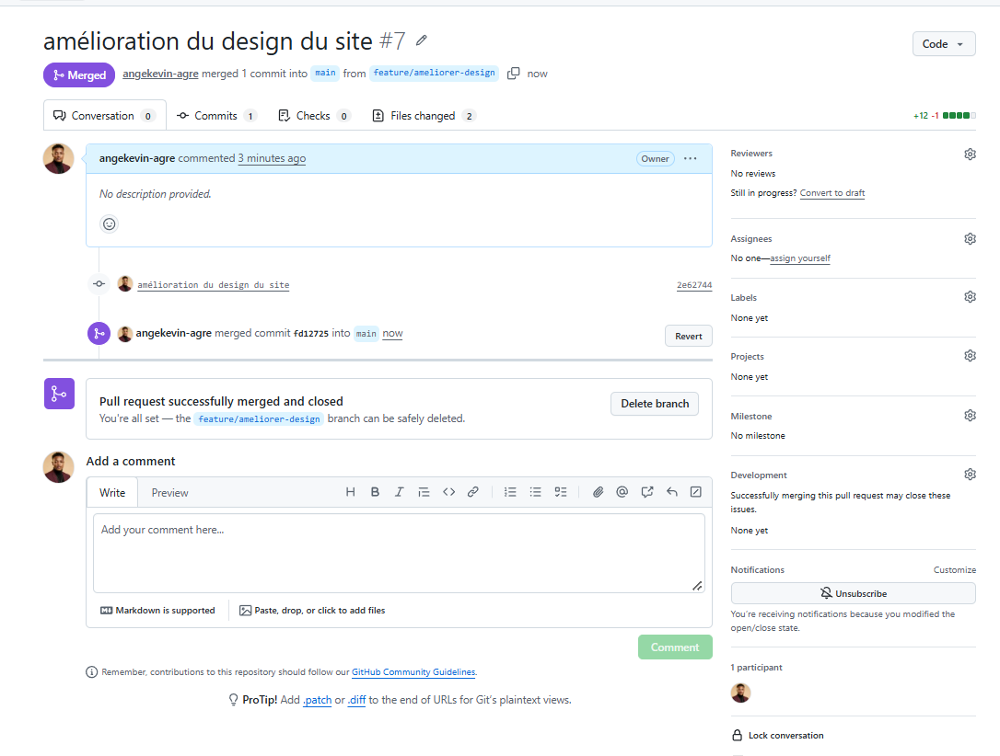

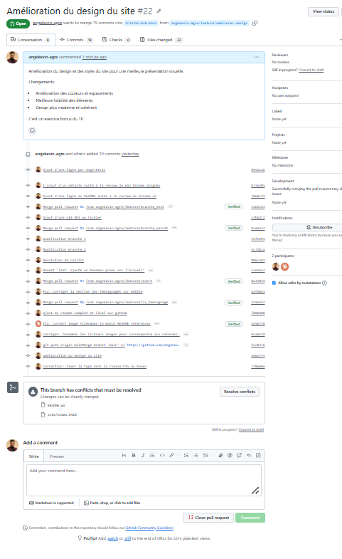
